## 14亿人的战争：中国人用了30年望见计算力的珠峰

原创 史中 浅黑科技 [浅黑科技](javascript:void(0);) *4月27日*

来自专辑 史中精选

**浅友们大家好~我是史中，我的日常生活是开撩五湖四海的科技大牛，我会尝试各种姿势，把他们的无边脑洞和温情故事讲给你听。如果你特别想听到谁的故事，不妨加微信（微信号：shizhongmini）告诉我。**

**14亿人的战争：**

**中国人用了30年望见计算力的珠峰**

**文 | 史中**

日本是一个喜欢“画面感”的民族。

从浮世绘、歌舞伎，到茶道、花道，到活着就是为了打篮球的《灌篮高手》、所到之处尸横遍野的《柯南》，总之，一哭二闹三上悠亚的日本，就是比四书五经六小龄童的天朝更讲究“排面儿”。

1941年冬天，日本飞机从云层中俯冲下来，直扑夏威夷的珍珠港。

很多美国军机的折翼都没来得及展开，就被按在机场的地面上摩擦，直接变成折翼天使，排面儿太美，不忍直视。直到今天，这都是行为艺术史上不可抹去的一笔。

干这事儿，日本海军司令山本五十六内心其实是一万个草泥马的。他是哈佛毕业的高材生，在灯塔国实打实生活过。

“主张和美国作战的，可以说是不了解美国的实力。美国生产力异常强大，海军官兵的行动也非常敏捷。我是军人，只要陛下一声令下我也会与美国作战。但是，我们尽最大努力恐怕也只能打上半年。”

这是山本开战前的原话。

果然，半年之后，中途岛一战，美国开始全面反攻。

那时候的美国究竟强在哪儿呢？

二战前，日本的工业产值占世界的3.8%，美国工业产值占世界的38.7%，底特律一条街的汽车比全日本的日车都多。

二战爆发后，美国迅速把全国的工业能力转向武器制造，从1941年到1943年，美军坦克产量从4052辆飙升到29497辆，翻了五倍。二战期间，美国造出了262524架飞机，在整体质量比日本高N个等级的情况下，数量还超过日本和德国的总和。

这些飞机坦克，美国还不是自己用的，而是给英国、法国、北非战场、中国战场整个反法西斯战线一起用，还绰绰有余的。日本投降，二战结束时，美国突然不用造飞机坦克了，干得正起劲的工人们还颇有些失落：建国200年都没这么好的工厂效益，这咋还不打了呢？

美国兵工厂的那种感觉，恐怕只有现在中国的口罩厂能够体会了。

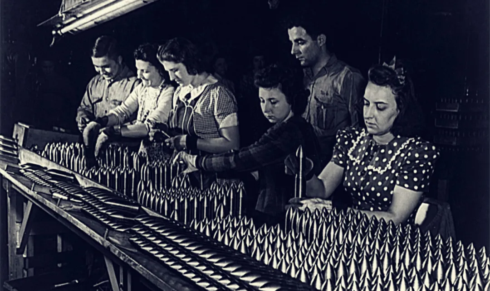

**二战期间在工厂里造炮弹的美国大姐。**

注意了，节目开始了！这段历史隐含了一个重要的问题：美国在战前生产的都是民用汽车，为啥变魔术似的说生产坦克就能生产坦克，还能毫无鸭力地运到亚非欧呢？

答案很简单，因为当时的美国拥有一个非常发达的“工业基础系统”，从四通八达的公路铁路海运网络，到上下游完整的生产线。这就像有了地基，你既可以在上面盖炮房，也可以在上面盖炮楼。这也称为“基建”（基础建设），是能够制造生产力的生产力。

爸爸的爸爸叫爷爷，生产力的生产力叫“基建”。

当时的美国可以一脸坏笑，对已经被打得和月球表面一样的中国说：基建是个好东西，希望你也有。

八十年过去了，我们终于有了史上最强的基建，公路遍布各村，高速公路遍布各市，高铁遍布各省，西电东送南水北调。美国人一偷懒，勤劳的我们就在东南沿海建起了全世界独一无二的工业分工体系。珍珠奶茶方便面，火锅米饭大盘鸡，床单被罩安全套，螺丝螺母电路板，只有你想不到的，没有我们做不出来的。

壮哉天朝，前途大好，这盛世如你所愿。。。

然而历史是个老司机，总是在你不经意间一个急转弯，冲上秋名山。

“计算机”这家伙，本来只是在战争中用来计算弹道的无名小卒，没想到二战后飞入寻常百姓家。这下事情朝着奇怪的方向去了：人手一部的计算机生生在现实世界之外制造出了一个“平行世界”——互联网。

在互联网里，什么山川河流大海国境线之类的阻隔全都被抹平了，人和人之间交流的唯一障碍只剩下文化和语言。正如1987年中国发出的第一封电子邮件里写的那样：越过长城，走向世界。（别笑，这是原话。）

这个平行世界在每个人的脑海里开辟了“第二战场”，而且像个泡泡一样越长越大，渐渐地人们抱着电脑手机，每天分配在上面的时间越来越多。第二战场的“战事”都快超过第一战场了，大有小三上位之势。

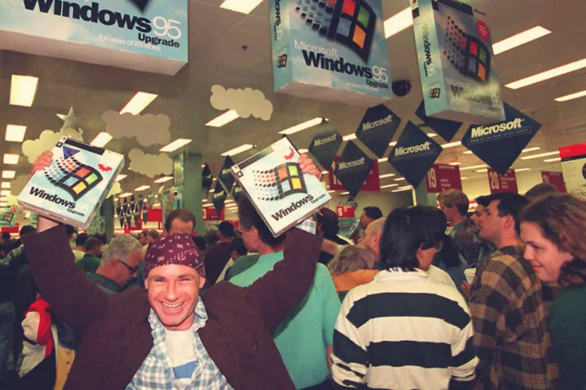

**1995年，美国人抢购 Windows95**

到了2020年，甄嬛眼看就要逼宫皇后，人们忽然发现一个要命的事实：**为物理世界所做的基建已经成百上千年，为平行世界所做的基建才刚刚上路。**

平行世界需要基建咩？既然是计算机创造出来的世界，最重要的基建之一当然就是——计算力。

从“计算力”的视角看这个操蛋的世界，你瞬间就像有了一副透视眼镜，能立刻读懂各个玩家的“底牌”。

接下来，中哥就带你重温一下这些紧张刺激干净卫生的“计算力里程碑”。

**（一）一场“世纪大交易”** 

电影里，主人公动不动就和魔鬼做交易。现实世界没有魔鬼，只有美帝，我们只能和美帝做交易。

**计算力的第一个里程碑：90年代引进西方的芯片、PC和操作系统。**

人们经常会犯一个错误，那就是把现在的问题简单归罪于过去的某个选择。

有关计算力，一个流传很广的判断就是：现在我们在芯片上落后于美国，就是因为当年选择了“造不如买，买不如租”的策略。导致我们大量进口芯片，养肥了 intel，自己的芯片产业却被彻底摧毁。

这也是现在很多人骂联想“美帝良心”的逻辑出发点。目测现在装满美国芯片的小米手机也有这个趋势。。。

骂得倒没什么不对，中哥不抬杠。不过我很好奇：退回到过去，如果我们真的能闭关锁国，美帝的芯片一颗都不允许进来，我们的历史会怎样发展呢？

有一点可能大概率发生，那就是“全中国人用到高性能的个人电脑”这件事很可能推迟十年或者更多。我们用的操作系统也大概可以参考朝鲜的红星操作系统。（当然，红星系统也挺漂亮。）

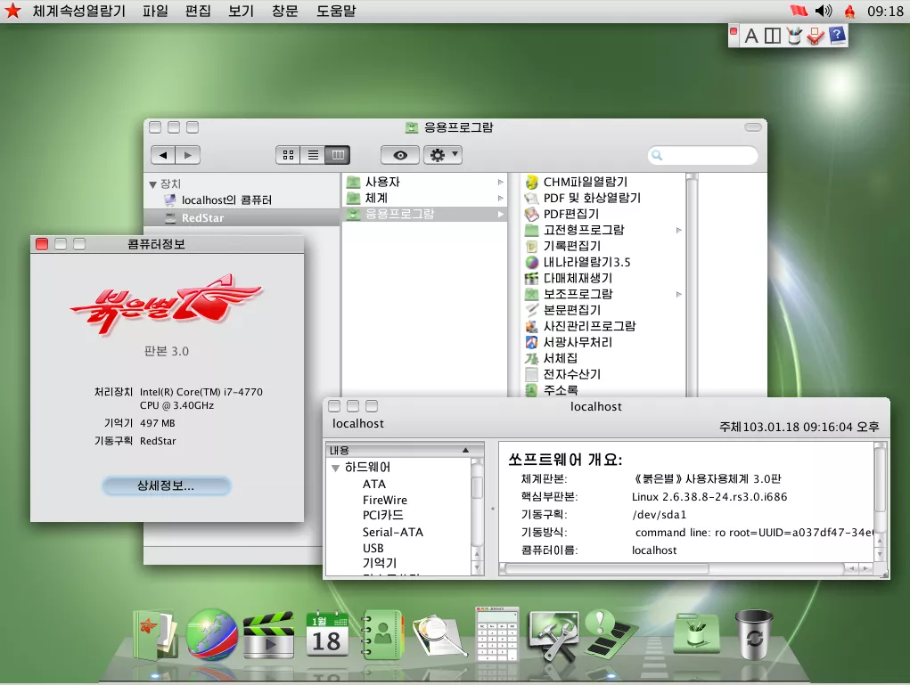

我突然想到了雷军的故事。

当年雷军加入金山，和求伯君他们一起，完全靠自主研发，搞出了中国人引以为傲的 WPS。求伯君出席发布会都穿中山装，说：“中国人不能没有自己的衣服，也不能没有自己的软件。”

后来怎么样了呢？90年代在和微软 Office 的交锋中一败涂地。那时候，正版 WPS 480元，正版 Office 97元，盗版 Office 5元。就算 WPS 的盗版也卖五块，可是上百个“国产司机”研发的 WPS 当然不如几千“美国车神”研究的 Office 好用。老百姓们安装盗版盘的时候，可就把民族精神什么地抛在脑后了，哪个香就装哪个。。。

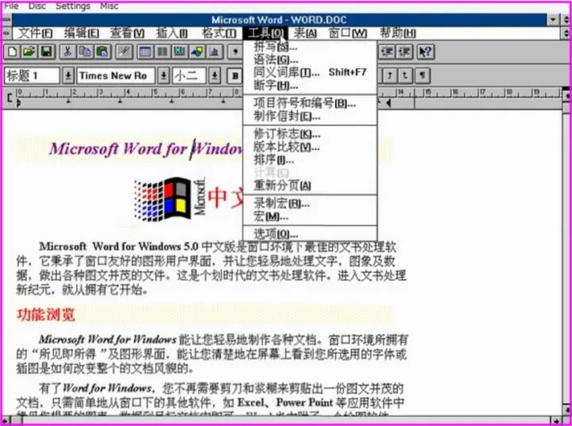

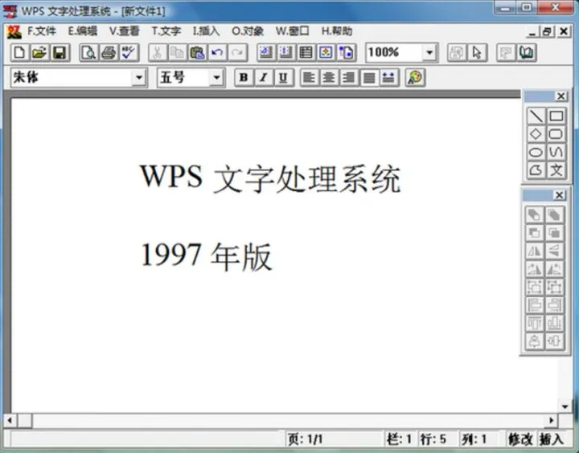

**1997年，同场竞技的 WPS 和 Word**

也许正是这段经历，让雷军明白了：“民族精神是要有，但前提是要活到下一集。”于是在小米的创业过程中，他肯定不愿意在同一个地方摔倒两次。别管小米手机里现在有多少美国芯片，起码小米活得还很好，所谓君子报国，十年不晚。

有人会说，我们宁可用“红星OS”，也要在芯片上争口气！假如国家强制支持国产芯片，电脑不好用，我们就不上网，不玩游戏不就得了，每天跳皮筋捉迷藏一样开心， 还能锻炼身体。这样忍一忍，不就忍成芯片强国了吗？

然而，这世界是个蝴蝶效应的系统，你改了初试设定，后面一定会引发连锁反应。

当年如果排斥美国芯片，代价很可能是：我们一直无法使用国际上最先进的芯片，基于芯片的软件发展也会随之被拖慢，中国互联网人口的增长会减速，于是，中国计算力的第二座里程碑很可能会被推迟。

**计算力的第二座里程碑：“云计算”的创世。**

这里有个很有趣的知识点：翻开历史，中国旧基建是由国家主导建设的，而新基建的历史却是由民企书写的序章。

说到云计算的创世，大概绕不过阿里云。

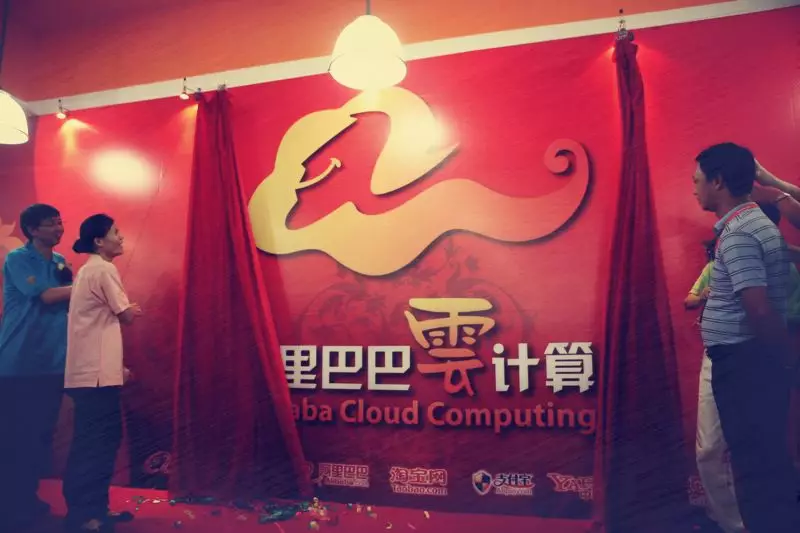

阿里这么伟大的吗？

并没有。其实不用避讳，民营企业，主要就是奔着挣钱去的。什么科技向善、实业报国，其实都是挣钱的副产品。有当然更好，没有也行。

中哥在[《大数据时代的狗》](http://mp.weixin.qq.com/s?__biz=MzU0NDEwMTc1MA==&mid=2247494915&idx=1&sn=bead5f53371fa5b1ef28245cbc864507&chksm=fb03e91acc74600ce6083ab0aa5532a5b7ebec0fe40323ed31e8864dfe4045faef1c3026c0e8&scene=21#wechat_redirect)那篇文章里写过，2008年，王坚博士被挖到阿里巴巴，最主要的目的就是为了建立一套大数据分析系统。大数据分析的目的，说白了就是要把商品更精准地推送给剁手党，让他们花更多的钱买买买。

大数据分析系统，在当时基本属于计算机应用科学王冠上的明珠。

要想有明珠，得先造个王冠。

大数据系统必须跑在云计算上，所以这个王冠就是云计算。

说到这，岔出去讲几句。其实在当时，最有希望夺下云计算王冠的是百度。百度出于广告业务的需要，比阿里更早地研发出了一套云计算系统。只是百度觉得，云计算系统只是个“基建”，只有个地基就拿出去卖钱，那不是奸商么？得在上面盖好楼盘再卖啊！百度所谓的“楼盘”，就是基于云计算的人工智能。

于是百度执拗地开始研究人工智能，一错神的机会，阿里云冲了出去，再一错神，连腾讯云都冲出去了。

犹豫就会败北，百度只能假装看不见，咬牙继续盖楼。万万没想到，这个楼是真费钱啊，才盖到一半儿，封顶无望，钱都快花光了，怎么办？老本行“竞价排名”那还能搞出来点钱不？什么？不能？不能也得能！！！

于是，技术实力最强且不想做奸商的百度却阴差阳错成为了公众眼里最奸商的奸商，简直就是奸商本商。。。

扯远了，说回阿里云。

其实阿里云的创立者王坚几乎就要复刻百度的命运——阿里云盖到一半儿，也没钱了。不仅没钱了，连人都跑光了。

当时阿里云员工的感觉，就像是1934年一个毛头小伙子刚刚满怀信心入了党，结果党中央要战略转移，开始爬雪山过草地地长征。如果不是最坚定的无产阶级战士，肯定是经历不住这种考验的。。。

幸亏啊，幸亏，幸亏马云爸爸在全体大会上稳住阵脚：“我一年给阿里云投10亿，投上10年，到时候再看！”

实际上，王坚博士喊了五年的信仰，最后是被马云花10亿给捞回来的。

**马云和王坚**

所以中哥一直说，抛开金钱谈信仰，就是耍流氓。（马爸爸退休之前的“福报论”不就是抛开金钱谈信仰么。。。）

阿里云这群疯子死去活来一折腾，客观上却给全中国建立起来一个云计算的底座。

当然，如果说中国的云计算底座仅仅有阿里云是不客观的。应该这样说：在中国最大的云计算底座阿里云的鼓舞下，一众大公司和创业者都开始坚信“云计算”这条道路，敢于把命运赌在其上。（用人话说就是，阿里看到钱了，大家都想分一杯羹。）

于是，众人拾柴。

腾讯云、UCloud、金山云、百度云、华为云、电信天翼云这一众英雄冲出历史的尘埃，踩着更多如今已经湮灭在时光洪流中成千上万的云计算厂商的尸骸，杀了出来。

直到这时，他们才顾得上喘口气，回望太平洋对岸。

亚马逊的 AWS，微软的 Azure，谷歌 Google Cloud 形成美帝的云计算基础设施，开始全球扩张，而在这千钧一发的时候，中国云计算企业拍马赶到战场——最先起跑的阿里云，还有很早就出海的 UCloud，还有靠游戏碾压世界的腾讯，还有在2000年左右就完成国际化的华为，都迅速顶住美国云计算厂商的进攻，在世界棋盘上圈住属于自己的地盘。

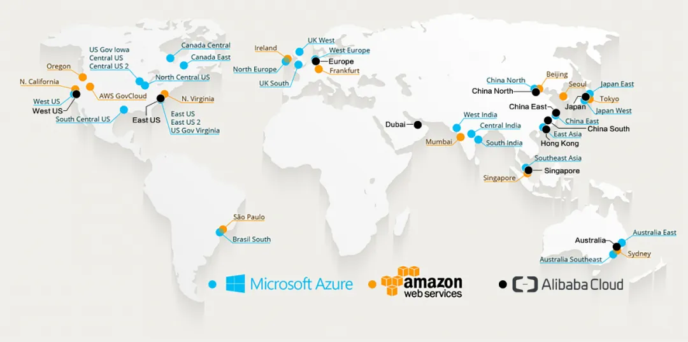

**这个是2016年全球三大云计算厂商计算中心的世界分布。黑色的点位是阿里云。**

了解了以上，我们再来回看中国计算力的历史，来路就很清晰了。

如果不是当年借助美帝的芯片让 PC 在中国普通家庭里快速普及，就不会有上亿的互联网人口，也不会有如此多的网购、游戏玩家和内容消费者，如此，阿里巴巴也就不会有冲动去建立大数据分析系统，阿里云在2008年创世的可能性就会大大降低，在这一波美国云计算公司的全球扩张浪潮中，我们很可能又签个《辛丑条约》之类的。

条约一签，再想翻身有多难，可以参考1900年。

回到我们的话题，总结成一句话应该是：**在历史的长河里，我们用芯片的代价争取了宝贵的时间，换回了世界顶级的计算力基础设施——云计算。**

你会说，那芯片这一课我们就永远补不上了吗？

别急，故事还在继续。

**（二）“社畜”一样的服务器**

地基之所以坚固，是因为它由混凝土浇筑而成。云计算之所以坚固，是因为它运行在一个个靠谱的**服务器**之上。

服务器这东西听上去很专业，其实说白了一点都不神秘，就是大号的电脑主机。

假设把云计算比作人的思维，那么服务器就是产生思维的这个大脑实体，对，就是你吃火锅涮的脑花。

**这就是猪界服务器。**

你可以简单地认为，电脑和服务器的发明者都是一个公司：IBM。

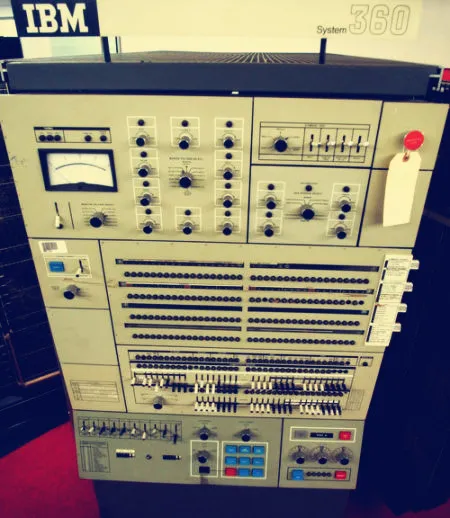

**IBM 最早的大型机服务器 System360。**

又是美帝的公司，真让人泄气。

“那不用问，中国云计算死去活来搞了那么半天，肯定跑在 IBM 的服务器上吧？”

你错了。

中哥都说了历史是个老司机。在服务器领域，历史又趁你不注意，一个急转弯，开上了秋名山。

本来，IBM 可是一手好牌，俩王带四个二。

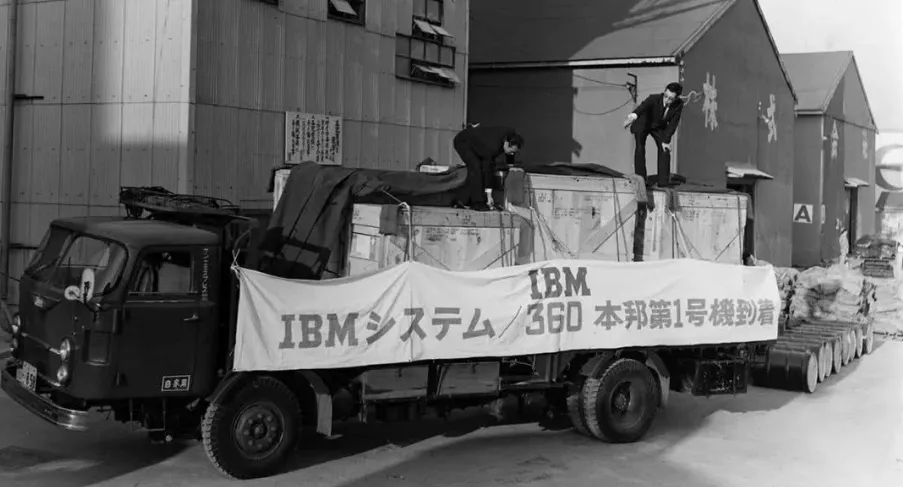

**当时日本东海银行就买了一台 IBM System 360，员工们终于可以扔掉了算盘，早下班陪家人了。**

IBM 服务器畅销到什么程度呢？2008年前后，阿里巴巴买 IBM 的服务器（小型机），那就跟玩儿似的。为了维持业务，恨不得淘宝网的利润的一大块都要用来买这货，可想而知 IBM 做梦都能笑出来。

结果呢？

刚才说了，王坚到阿里巴巴，要做大数据分析系统。而大数据系统是很耗费计算力的。

打个比方吧：如果说一般的数据系统好比一辆轿车，百公里也就烧十个油，那么大数据系统就是民航飞机，跟喝汽油一样。需要的计算力大了几个数量级。

这玩意儿要是再跑在 IBM 的小型机上，那阿里的生意不要做了，光买 IBM 服务器就能买到破产，一年到头估计还得欠 IBM 好几个亿。

于是，阿里巴巴决定，新做的阿里云系统坚决不能跑在 IBM 的 Power 架构服务器上，而是要跑在便宜的 x86 服务器上。

x86 服务器，说白了就是使用 intel 芯片的服务器，你日常用的个人电脑就是 x86 架构的。

Power 架构是 IBM 提出来的，所以他自然就会守着这个架构不放，觉得个人电脑的 x86 架构难堪大用。当时虽然在 IBM 内部也有 x86 架构的服务器团队，但是基本上就是“后娘养的”，连个窝头都吃不上。

结果，死贵死贵的 IBM 终于成了各大厂商围殴的对象。阿里巴巴专门发明了一个词，叫“去 IOE”，其中的“I”就是 IBM。要不是恨到了一定程度，不会专门起个名骂它的。。。

其实，阿里巴巴弄得这么热闹，完全是自找的。因为腾讯和百度就压根没考虑过 IBM，他们从一开始就在用 x86 架构的服务器。（这是因为阿里巴巴的电商业务对数据准确性和计算力要求更强。）

x86服务器哪家强？在那个时代，国际上最强的 x86 服务器厂商应该是戴尔和惠普。这很合理，因为他们过去就是生产个人电脑的。

好不容易把 IBM 搞掉了，替换它的还是美国公司。。。

故事讲到这里，终于有一家中国公司强势插入我们的主线故事，那就是浪潮。

相比阿里巴巴，了解浪潮的人就少多了。浪潮脱胎于山东电子设备厂。想当年中国第一颗卫星东方红一号里面，就有他们生产的晶体管。

在90年代，浪潮的带头人孙丕恕就主持研发出了中国第一台 x86 的服务器，他也被称为中国服务器之父。

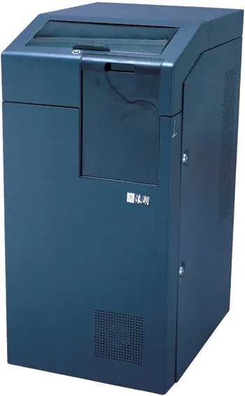

**中国第一台 x86 服务器，浪潮 SMP2000。里面有十颗 intel “486”CPU。**

由于研发出了最早的 x86 服务器，国家863计划把后续研究 x86 服务器的重担都交给了浪潮。这么一指派，就阴差阳错地让浪潮站在了历史的风口上。

这一波云计算的兴起，浪潮可算是抓住机会，奔走在各大云计算厂商之间。论价格，我比国外服务器便宜，论定制化，我什么姿势都能给。（参考[《浪潮网恋史》](http://mp.weixin.qq.com/s?__biz=MzU0NDEwMTc1MA==&mid=2247492271&idx=1&sn=711064a5d698898027b9ae925890bc24&chksm=fb03e6b6cc746fa074b05a6b39c5e50350f82e2921fd7a2cec204fd37300af6e468f3e86e299&scene=21#wechat_redirect)）

眼看浪潮如今（2020年初）已经冲到了服务器世界第三的位置，不仅行销全国，还卖到了亚非欧美拉，中国人倍有面子。当然，紧随其后的还有“彪悍的人生不需要解释”的华为和收购了 IBM x86 服务器业务的联想。

**x86 服务器**

注意，这里有一个很有趣的现象。

x86 服务器之所以能流行，是因为它是一个开放的生态，intel 只生产最核心的那块 CPU，至于服务器的其他部件，它给出标准，谁生产都行。

这有点像手机，反正就是芯片、电池、主板、外壳，不需要很高的技能就可以组装。这样的话就会导致一个结果：品牌机肯定便宜不过山寨机。

于是，在服务器领域，也出现了一票“山寨机”。这些山寨机一般是由戴尔、惠普在台湾的代工厂所生产的，由于不挂戴尔、惠普的标，所以也叫“白牌服务器”。

白牌服务器很便宜，炒鸡便宜。

**白牌服务器**

于是，我们走到了计算力的第三个里程碑。

**计算力的第三座里程碑：服务器的“社畜化”。**

在现代工业体系的加持下，服务器越来越像社畜。

你出门买一袋盐，会很在意你买的是什么牌子么？大多数人不会。工头让你去买砖，你会去特意买什么品牌的砖吗？也不会。老板招一个程序员，会关心他身高体重家庭背景吗？不会。为啥呢？因为在现代化工业体系下，盐和盐基本都一样，砖和砖基本都一样。社畜和社畜差不离。

同理，服务器和服务器也很类似。

而且，云计算厂商之所以敢放心地购买白牌服务器，还有一个原因，那就是上层的软件系统已经被打磨得很完善，坏一台服务器，软件立刻就把工作负载无缝转移到别的服务器上。就好像你突然进了 ICU，老板一分钟之内就可以把你的任务分给其他社畜，你死不死，无，所，谓。

还记得我们之前说的么：**计算力的底层是服务器，服务器的成本很大程度上会决定计算力的成本。降低服务器成本的秘诀你可能猜到了，只有三个字：富士康。**

当然，富士康只是代名词，在服务器代工领域的大佬是英业达、纬创之类。它们都是台湾公司，而台湾是中国领土不可分割的一部分。

说到这，中哥又要重复一遍我们的中心思想了：

“**在历史的长河里，中国用芯片的代价争取了宝贵的时间，换回了世界顶级的计算力基础设施——云计算。云计算又反过来把服务器产业链抓在自己手里。**”

你可能会说，服务器代工厂都在中国台湾，这不保险吧。。。

确实不保险。其实，中国大陆已经崛起了很多代工厂，例如比亚迪就刚刚接手了华为手机的代工，闻泰科技一直为小米手机代工。前段时间，郭台铭也很有诚意地把富士康的一部分挪到了大陆来上市，名为工业富联。

故事讲到这，你会发现，我们拥有云计算技术，也可以把控服务器代工产业，整个计算力链条里，只有一件事儿似乎还超出我们的控制，那就是服务器里的芯片。

终于到了芯片。

**（三）\**“芯片”\**，出来混总是要还的** 

中国人一直想在芯片上摆脱“卡脖子”的，例如龙芯、飞腾、兆芯。我们最初确实想用这些芯片替代 intel，进入中国的个人电脑市场。但是这条路已经被证明失败了。因为 intel 和 windows 形成了联合生态，想用 windows，就得用 intel。当年把 intel “引狼入室”的那一刻，就注定了我们很难再把 intel 替换掉。（别说中国人，美国人也换不掉。只不过 intel“恰好”是个美国公司。）

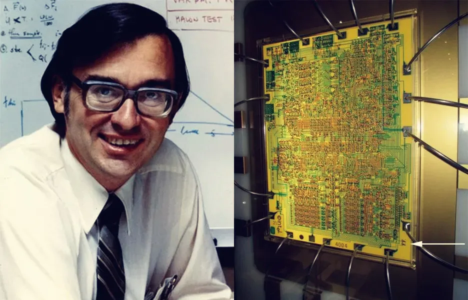

**特德·霍夫是 intel 第12号员工，他发明了世界上第一个 CPU。上图是他和第一款 CPU intel 4004 的示意图。**

但是，随着计算力作为基础设施存在，芯片的自主可控希望又回来了。

因为人们需要的是计算力，而计算力底层是服务器，服务器底层才是芯片——**只要能提供计算力，底下爱是什么芯片就是什么芯片。**

例如华为，就在做一款 x86 架构的“备胎”，基于 ARM 架构的处理器：鲲鹏处理器。

ARM 和 intel 有什么区别呢？

intel 会把生产好的芯片卖给全世界，ARM 却卖“图纸”——芯片 IP 授权。其他公司买了这个授权，可以自己找人去生产。

**简单说：如果把 intel 比作卖大米的，那么 ARM 就是卖种子的。****如果没了大米，我们下个月就饿死。如果没了种子，我们明年才饿死。。。**

所以，你大概明白：从 intel 换到 ARM，说白了是从一个依赖换成了另一个依赖，只不过依赖变小了。

不过，ARM 是一家英国公司。而且 ARM 被软银收购了，也算是一家日本公司，这和美国有关系吗？有关系。研究 ARM 芯片的主力工程师都是美国人，美国人威胁说：芯片里有超过 25% 的美国技术，美国不同意，ARM 随便卖就违法！

2019年，ARM 就因为美国的威逼利诱，宣布暂停和华为的合作。不过英国人也很刚，后来完成了法律方面的确认，说我们的技术跟美国人没关系，100%属于英国，想卖谁卖谁，继续和华为做生意。

看到这，你可能都烦了，怎么说来说去，芯片总也摆脱不了对美国的依赖啊？

别急，接下来就到了我们的第四个里程碑。

**计算力的第四座里程碑：芯片开源。**

要我说，华为依附于 ARM 做了这么多年芯片，最主要的目的其实是锻炼一支可以“魔改”芯片的队伍，有朝一日找到新机会，这支队伍可以直接杀出去从头设计一套芯片。

其实，在芯片领域，已经出现了一个“没有国籍”的架构，这就是始于加州大学伯克利分校的 RISC-V 开源架构。

开源，意味着全世界的大神都在给这个架构做贡献，代码也是完全免费公开的。于是，再也没有人可以用任何理由来控制它。

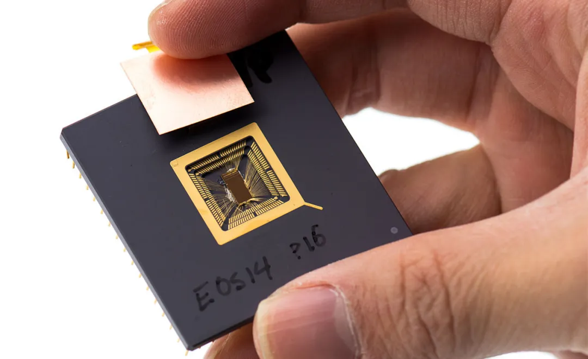

**RISC-V 的处理器原型，2013年。**

说到这，又得说回咱们的梦想家，中国云计算第一把交椅的所有者，阿里巴巴。

2018年，阿里巴巴收购了芯片公司“中天微”，重组为“平头哥”。这名字一看就是马云给起的，所谓“生死看淡，不服就干”。冲这名字，也是一场大战在所难免的节奏。。。

平头哥推出的第一款芯片IP——玄铁910，就是基于 RISC-V 架构的。

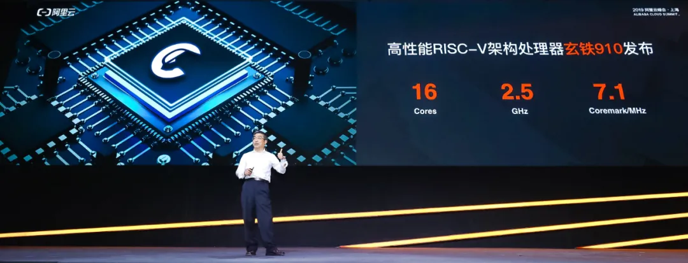

当然，目前 RISC-V 架构主要用于“小玩意儿”上，例如物联网设备，难以作为服务器芯片。但是想当年 ARM 芯片也被认为是用在小玩意儿上的，如今不也被华为用来做服务器芯片么？

有大佬认为，随着 RISC-V 的成熟进化，计算力会迅速提高，大概五年之后，它就可以应用在服务器上，作为排在 intel 一号备胎 ARM 后面的二号备胎。

这并不意味着云计算厂商真的要用 RISC-V 替换掉 intel 的芯片，只是如果中华民族真到了“最危险的时候”，intel 不卖给中国芯片，ARM 也不卖，那我们没有白面至少还有棒子面。但想饿死中国的计算力，那是不太可能了。

而且，在芯片领域正在发生一个影响极其深远的变化。

受限于科学天花板，芯片技术的步伐已经放缓了，intel 都被称为牙膏厂好久了。这个时候，要想提升计算力，最好的方法就是从“通用计算”变成“异构计算”。

“通用计算”和“异构计算”有啥区别？举个例子你就明白了。

通用计算就像是大学生，学好数理化，走遍天下都不怕，绝大多数职业都能干。

异构计算就像是博士后，在一个非常窄的行业里他是专家，但是如果逼他做其它行业的事情，很可能效率奇低。

例如，人工智能芯片就是典型的“异构计算”。在这个领域 NVIDIA 是领头羊，但并不是不可撼动的巨头。全世界有技术力量的公司都在开发属于自己的AI芯片，这其中也包括阿里巴巴、华为、百度等等。

综上所述，中国企业造芯片，各方面所受到的限制都在快速减少，中国芯片的春天才刚刚来临。

不过刚才我们说的，其实都是芯片设计。然而，即使中国掌握了全球顶尖的芯片设计技术，我们还面临一个更巨大的问题：没办法把芯片造出来。

因为，造芯片需要一种究极神器——光刻机。

**（四）物理世界和网络世界的交汇点——光刻机** 

光刻机的技术有多高级，看看这个知乎提问，可以感受一下：

有人这样形容光刻机：这是一种集合了数学、光学、流体力学、高分子物理与化学、表面物理与化学、精密仪器、机械、自动化、软件、图像识别领域顶尖技术的产物。

它大概长这样。

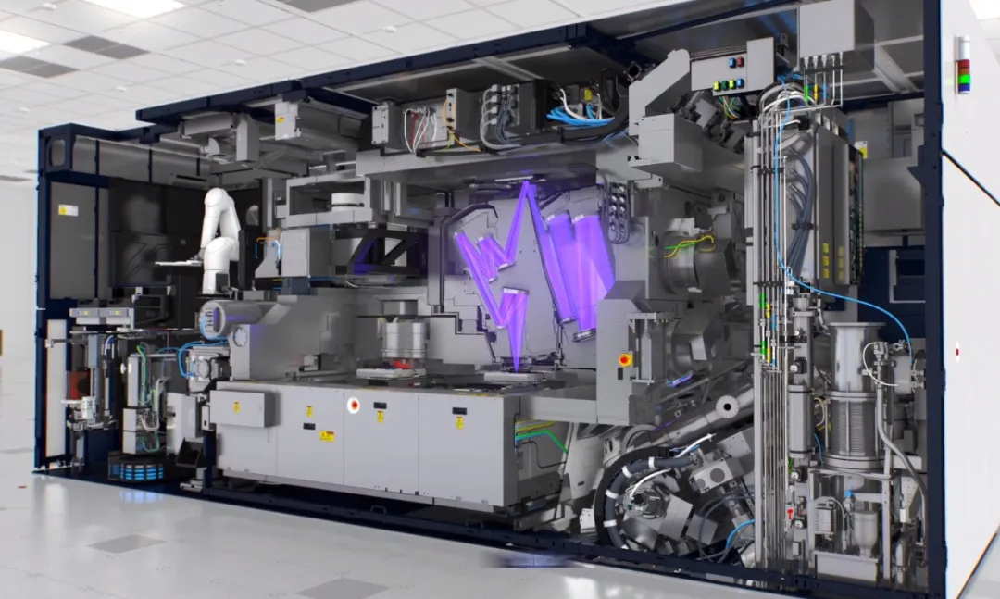

**光刻机示意图**

别看说得这么热闹，其实这玩意儿的工作原理就是用“紫外线”作刀，对晶圆进行雕刻，让芯片上的电路变成人们想要的图案。四个字形容：**“硅上雕花”**，跟扬州修脚的“肉上雕花”一个意思。

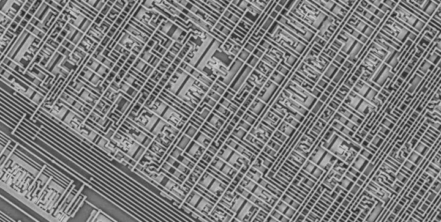

**这是刻出的芯片图案**

不过，同样是“雕花”，你看看数据就知道光刻机比修脚师傅厉害到不知哪里去了。

现在最先进的 EUV 光刻机可以做到的“雕刻精度”是7nm，这相当于一根头发的万分之一。

由于要达到这样的雕刻精度，在雕刻的过程中晶圆需要被快速移动，每次移动10厘米，可是误差必须被控制在纳米级别。这种误差级别相当于眨眼之间端着一盘菜从北京天安门冲到上海外滩，恰好踩到预定的脚印上，菜还保持端平不能洒。

做出一个芯片大概需要3000步工序，由于每一步都是“硅上雕花”，有一定失败概率，三千步下来，要想让最终的成品合格率大于95%，那么每一步的失败率就必须小于0.001%。

为了达到这种效果，最先进的光刻机上有10w个零件。（一辆汽车大概是5000个零件）

光刻机就像科幻小说里的虫洞那样，这边是物理世界，那一边是赛博世界。

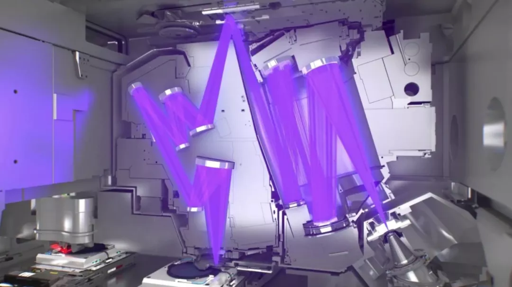

以前，全世界能批量生产高端光刻机的厂家只有三家，荷兰 ASML，日本的尼康和佳能，但是最新一代光刻机研发烧钱烧得太邪乎，尼康和佳能基本已经弃疗了。目前，ASML 一家占据全球光刻机市场的85%，利润的107%。

2012年，在研究最新的 EUV 光刻机时，ASML 也觉得研发费用无底洞，想放弃，差点从 ASML 变成了 AWSL。结果那些等着光刻机续命的芯片企业慌了，intel、三星、台积电从家里拿来大几十亿美元支持 ASML，求它再坚持一下。

于是，ASML 终于造出了能制造 7nm 制程芯片的光刻机，每台卖一亿美元。。。

一亿美元，其实不贵，也就北京几套房。

但问题仍然是：光刻机不是你想买，想买就能买。

说到这里，就要提到1996年签署的《瓦森纳协定》。瓦森纳协定本名叫“瓦森纳安排机制”。简单来说就是：美国带着他的小伙伴不把东西卖给别的国家。我不知道都有哪些国家被“安排”了。反正中国是被安排得明明白白的。

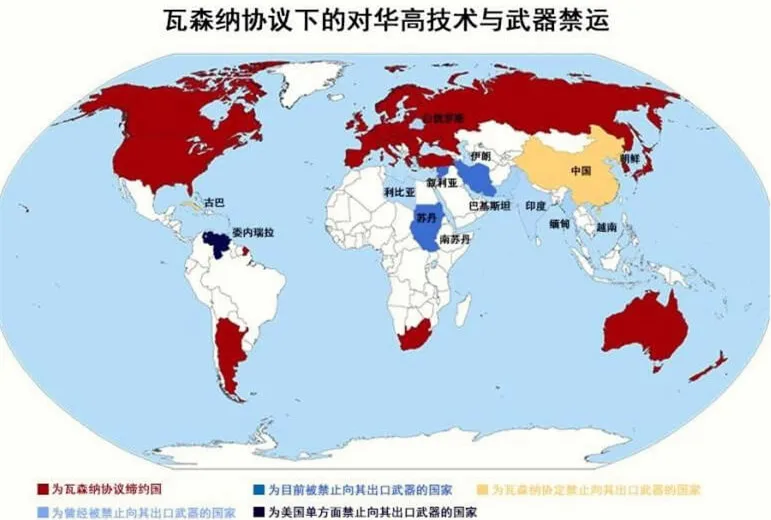

就拿光刻机来说，中国台湾的台积电想买多少有多少，而大陆版的“台积电”——中芯国际——订了一台7nm光刻机，据说到现在都没拿到出口许可证。于是，目前中芯国际最精细的制程是14nm。

这就导致一个结果：截止2020年春天，中国大陆没有制造7nm制程芯片的能力。而目前最尖端的芯片，例如华为手机的最新芯片（麒麟980、麒麟990）已经是7nm制程的，如果台积电被逼选边站搞事情，中国大陆企业就很难受。

中国可以生产光刻机吗？

答案是：可以。

中国最牛的光刻机生产商是上海微电子装备公司（SMEE），它可以做到的最精密的加工制程是90nm，相当于2004年最新款的 intel 奔腾四处理器的水平。

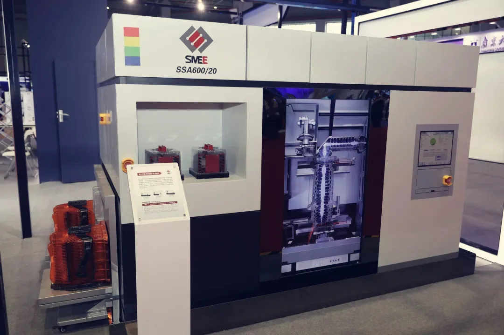

**SMEE 的光刻机**

别小瞧这个90nm制程的能力。这已经足够驱动基础的国防和工业。哪怕是面对“所有进口光刻机都瞬间停止工作”这种极端的情况时，中国仍然有芯片可用。

在这种情况下，“断供”就达不到“弄死人”的效果，最大的作用其实是“谈判筹码”，不会真的发生。

于是，中国这两年芯片进口价值超越了石油，蔚为壮观。计算力“基建”的最后一颗龙珠也基本稳住。

这些芯片进入了服务器和移动设备，成为了云上算力和端上算力，组成了庞大的**“互联网基建”**，组成了下一个大时代的入场券。

这篇文章写于2020年，如果你来自未来，你可能还会记得这一年是个特殊的年份。

这一年，病毒来袭。好多人都宅在家里，对着网上的菜谱做饭，对着摄像头开视频会，在微信和钉钉里商量方案。

这一年，很多生产线的调度管理任务开始被自动化系统接管，比人效率更高，出错更少。很多机器人奉命在楼宇中喷洒消毒剂，还接管了快递的配送任务。

这一年，人们为了对抗病毒，在武汉修建了火神山雷神山两大医院，医院所有的计算力都来自于云端，人工智能帮助医生查看患者肺部的片子，为抢救生命节省宝贵时间。杭州、北京的专家可以通过5G信号和奔腾的光缆，远程为患者做实时诊疗。

这一年，巨头们火速开发了基于大数据的健康系统，扫一个码就能同步所有健康信息。

这一切，都依赖于我们的计算力基建。

**这是2020年春天，小朋友通过“云课堂”上课。**

**雷神山医院在用 AI 做肺炎诊断。**

**（五）枪和玫瑰** 

我们的故事得停在这里了，因为未来尚未发生。

你可能觉得惭愧，在中国计算力这个宏大的故事里，自己好像并没做什么贡献。不过中哥得说，你的贡献很大。

1998年你打开“红警”“仙剑”的时候，2000年你进入网易聊天室的时候，2004年你小心脏怦怦跳着注册QQ号的时候，2005年你心惊胆战地在淘宝上下第一单的时候，2010年你把诺基亚换成跑着安卓系统的 HTC 的时候，2014年你刷着微信朋友圈愤世嫉俗的时候，2017年你羞涩地发出第一条抖音视频的时候，2020年你第一次使用钉钉远程开会的时候，都在为这个国家的计算力“基建”做贡献。

于是，每个人具体的生活轨迹和奋斗历程，汇成了技术史的一个侧颜。14亿人用了30年，望见了计算力的珠峰。

科技不仅能制造原子弹，也可以煮出茶叶蛋。科技并不仅仅能计算弹道轨迹，也可以计算外卖的最佳路径。**科技让****你我这样的普通人也能在岁月里****获得快乐、安宁、勇气和尊严。**

**
**

**科技是枪，也是玫瑰。**

有时人们持枪远征，荒废了玫瑰园；有时人们沉迷园艺，家园却被铁蹄踏平。

而在那些伟大的故事里，人们手握钢枪，身后鲜花盛开。

