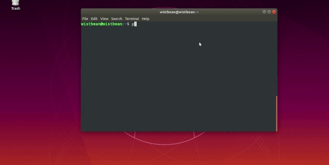

<https://zhuanlan.zhihu.com/p/140476446>

# 你要的 Python 创建 GUI 用户界面程序，来咯

[学习python的正确姿势](https://www.zhihu.com/people/xue-xi-pythonde-zheng-que-zi-shi-92)

关注我的公众号：「学习python的正确姿势」，像看小黄文一样轻松学习python！

关注他

90 人赞同了该文章

时不时就有 b 友让我整点

“Python GUI 相关的教程”

今天小帅b就来给你说道说道

用 Python 来写 GUI 的库有好几个

比如 pyqt、wxpython、tkinter、kivy

相对来说比较常用的是 tkinter它是 Python 内置的库用起来比较 “直接了当”

是这样的

TK 是一个开源的开发工具包

里面提供了很多界面组件的接口

比如按钮、选项框、输入框这些

而且这些组件是跨平台的

在不同的操作系统中都可以运行

比如你常见的 MacOS，Linux，Windows

既然如此

Python 就把这些接口调起来

封装成函数和类

然后整成 tkinter 模块

这样当我们想要写 GUI 的时候

直接使用 Python 调用 tkinter 就好了

在你的终端里面输入“python -m tkinter”

出现类似的窗口说明你的 tkinter 和 tk 都给安装上了